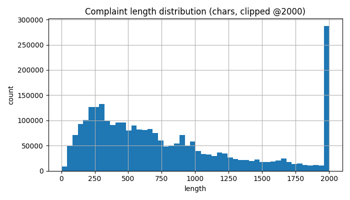

# EDA Summary

## Class balance (rows per split)

```
label        0       1     2      3
split                              
test    342682   55884  1423  20289
train  1593867  260187  6654  94247
val     341330   55558  1384  20301
```

## Text length stats (chars)

```
         count    mean  median     p90    max
split                                        
test    420278  967.28   627.0  1991.0  32609
train  1954955  968.80   628.0  1989.0  35984
val     418573  971.13   628.0  2001.0  35984
```



## Example texts (first 3 per class)

### Class 0
1. These are not my accounts.
2. The following accounts were disputed with all three major credit bureaus. One or more bureaus confirmed the accounts were inaccurate and removed them. However, the other bureau ( s ) failed to provide adequate verification or returned vague responses, resulting in inconsistent and unfair credit repo...
3. Kindly address this issue on my credit report. I assert that this account is not mine and believe it to be fraudulent. I urge you to correct this mistake and have provided supporting documents for verification.

### Class 1
1. RE : Attentively review my formal writ composed declaration of not proven complaint misinformation that is all or in part : deficient of the adequate current status in the fullness of TRUTH, ACCURACY, COMPLETENESS, TIMELINESS, documented OWNERSHIP, certifiable RESPONSIBILITY, or otherwise irrefutabl...
2. This complaint is against S & S Recovery , Inc. for publishing an unauthorized debt collection account to my credit report without any form of validation, contract, or legal right to do so. I was never notified, never served, and never received my dispute rights under FDCPA 809.  They are illegally ...
3. It stated that I owe a balance of {$720.00}. If I paid in full, I would receive XXXX points.

### Class 2
1. This letter is to raise concern about service I recently received from a Key Bank XXXX branch. I was cold called even though I am on the do not call list on approximately XX/XX/2016 by a Key Bank XXXX employee and was offered a personal loan for credit card consolidation in the amount of $ XXXX My w...
2. I paid off my car loan XXXX 2015. Istill do have not received a clear titleafter numerous contact with loan co.  have been paying full coverage $ XXXXper month. can get liability for $ XXXXfor 6 months The payoff wasinstructed to send to XXXX XXXX XXXX XXXX XXXX, SC XXXX
3. The loan company made calls to my references when I was late on making a payment. They left a voicemail. In the message ( I have them recorded ) they mention who they are, that they are looking for me and to tell me to call his auto loan company immediately. So, my references then call me to tell me...

### Class 3
1. Rushmore Loan management XXXX will not permit applying for loan modification online and direct you to call. However, they do not answer the phone and the phone directs you to go online.   I have spent hours trying to reach this company to no avail. Many times they tell you to call back during busine...
2. This complaint is for TCF, Identical complaint filed for XXXX XXXX XXXX There are two lenders involved in my complaint. I had a HELOC loan with TCF bank that sold my loan to XXXX XXXX  XXXX  back in XXXX of this year. This loan was actually converted to a long term loan many months earlier and we no...
3. After being approved for, and receiving a payment supplement from the US Department of Housing and Urban Development ( HUD ), due to being behind on payments on an FHA-insured mortgage, I decided to sell my property. During the process, I learned that I needed to request a payoff statement from HUD,...
